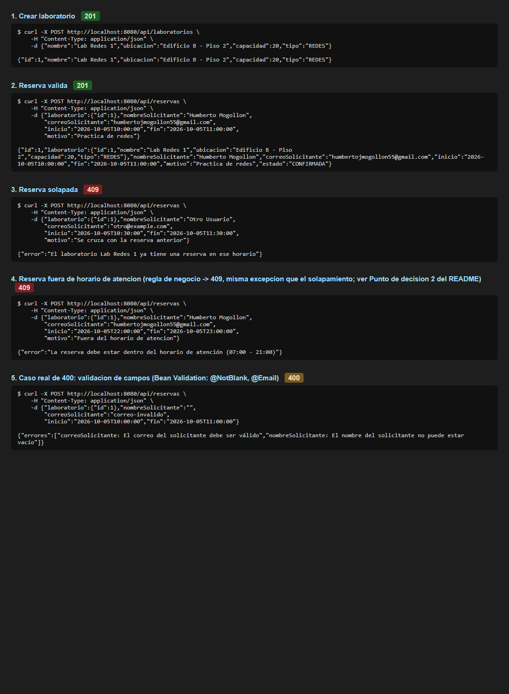
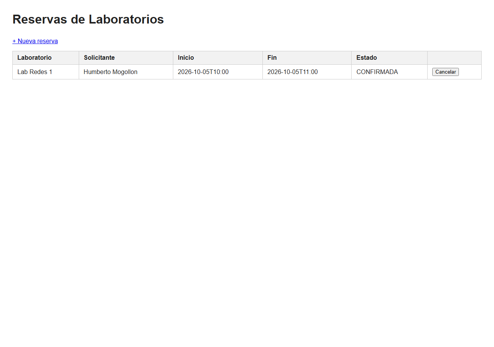
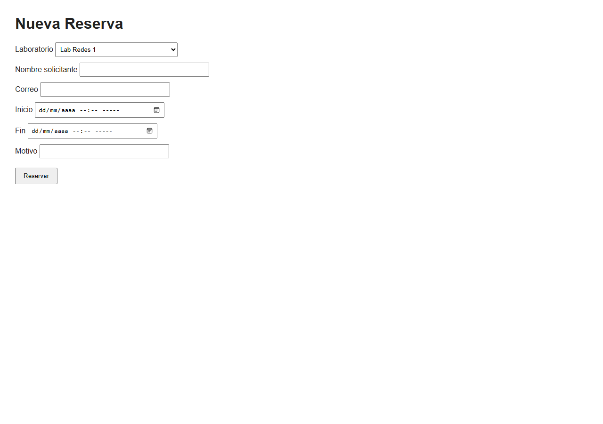
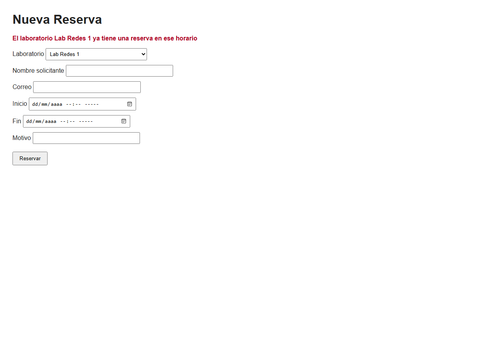

# Post-contenido — Unidad 5: Integración en Aplicaciones Web

## Descripción

Repositorio del post-contenido de la Unidad 5 de Patrones de Diseño de
Software. Un único proyecto Spring Boot (`reservas-labs-api`) para la
reserva de laboratorios de cómputo de la universidad, con dos partes
sobre la misma base de código: una API REST en capas completas
(Entity, Repository, Service, Controller) sobre H2, y una vista
Thymeleaf (MVC clásico) que reutiliza exactamente el mismo `Service`
que ya usa la API.

## Parte 1 — Repository, Service y Controller REST

`LaboratorioRepository` y `ReservaRepository` extienden `JpaRepository`;
`ReservaRepository` agrega la consulta JPQL `buscarSolapamientos` que
filtra en la base de datos las reservas activas que se cruzan con un
rango de tiempo dado. `ReservaService` concentra las reglas de negocio
reales del dominio: solapamiento de horarios, horario de atención
(07:00-21:00), duración permitida (30 min - 3 h) y cancelación de
reservas cuyo inicio ya pasó. `ReservaController` y
`LaboratorioController` exponen `/api/reservas` y `/api/laboratorios`
respectivamente, sin que ninguno de los dos contenga lógica de negocio
propia. Ver paquetes `model/`, `repository/`, `service/`,
`exception/` y `controller/`.

## Parte 2 — Vista MVC con Thymeleaf

`ReservaWebController` expone `/reservas` con Thymeleaf, inyectando la
misma instancia de `ReservaService` que usa la API REST — sin
`Service` duplicado ni lógica de validación reescrita. Las plantillas
`lista.html` y `nueva.html` cubren listar, crear y cancelar reservas
desde el navegador. `ReservaWebExceptionHandler` maneja las mismas
excepciones de dominio que `GlobalRestExceptionHandler`
(`ReservaConflictException`, `RecursoNoEncontradoException`), con
presentación distinta: redirección con mensaje flash en vez de JSON.
Ver paquete `web/` y `templates/reservas/`.

## Cómo ejecutar

```
mvn clean package
mvn spring-boot:run
```

- API REST: `http://localhost:8080/api/reservas`
- Vista MVC: `http://localhost:8080/reservas`
- Consola H2: `http://localhost:8080/h2-console` (JDBC URL: `jdbc:h2:mem:reservas_labs_db`, usuario `sa`, sin contraseña)

## Decisiones de diseño

### Punto de decisión 1 — Ubicación de la validación de solapamiento

El filtrado de qué reservas se solapan con un rango dado vive en
`ReservaRepository.buscarSolapamientos`, como una consulta JPQL que se
resuelve del lado de la base de datos. La decisión de qué hacer con
ese resultado —lanzar `ReservaConflictException` con un mensaje
claro— la toma exclusivamente `ReservaService.crear()`. La alternativa
descartada fue traer todas las reservas del laboratorio a memoria con
`findByLaboratorioId` y comparar los rangos con `Duration`/`LocalDateTime`
en Java: funciona igual de bien con pocos datos, pero el costo crece
sin límite con el historial de reservas de un laboratorio, mientras
que la consulta JPQL siempre trae solo las filas que realmente
importan. Si `ReservaController` llamara directamente a
`buscarSolapamientos()` sin pasar por el Service, obtendría la lista
de conflictos pero nada decidiría qué significa esa lista para el
negocio: no se lanzaría ninguna excepción, no habría mensaje para el
usuario, y la regla "no se permite reservar en un horario ocupado"
dejaría de existir como tal, porque esa regla no es un dato que la
base de datos conozca, sino una decisión que corresponde al dominio.

### Punto de decisión 2 — Reglas con y sin apoyo del Repository

`validarHorarioYDuracion` vive enteramente en `ReservaService`, en
Java puro, sin tocar ningún Repository, porque depende únicamente de
los campos propios de la `Reserva` que se está creando (su `inicio` y
su `fin`) y no necesita comparar contra ninguna otra fila de la base
de datos. El criterio que separa ambos tipos de regla: si validar
exige comparar contra datos que solo la base de datos conoce —como
"¿existe otra reserva que se cruce con esta?"—, la validación se apoya
en una consulta del Repository, como ocurre con el solapamiento
(Punto de decisión 1); si la regla solo depende del propio objeto que
se está validando, como el horario de atención o la duración mínima y
máxima, no hay ninguna razón para involucrar al Repository ni a la
base de datos, y hacerlo de todas formas sería un viaje a la base de
datos innecesario además de una regla más difícil de probar de forma
aislada.

### Punto de decisión 3 — Cómo comparten Service el Controller MVC y el REST

`ReservaWebController` y `ReservaController` reciben por constructor
la misma clase `ReservaService`, que Spring gestiona como un único
bean singleton; ninguno de los dos controladores reimplementa la
validación de solapamiento ni la de horario. La alternativa
descartada fue copiar la lógica de validación dentro de
`ReservaWebController`, o crear un segundo `ReservaWebService` casi
idéntico a `ReservaService` solo para la vista MVC. Esa alternativa
habría significado que, si en el futuro cambia la regla de
solapamiento (por ejemplo, para permitir reservas simultáneas en
laboratorios con varios cupos), habría que corregirla en dos lugares
distintos y recordar mantenerlos sincronizados — exactamente el
problema que la capa Service existe para evitar. Con una sola
instancia compartida, una reserva creada desde `/reservas/nueva`
queda sujeta a las mismas reglas que una creada por `POST
/api/reservas`, sin que el formulario web necesite saber cómo se
implementa esa validación.

### Punto de decisión 4 — Manejo de errores consistente entre MVC y REST

Se usan dos manejadores de excepciones en vez de uno solo:
`GlobalRestExceptionHandler`, restringido a los `@RestController` con
el atributo `annotations`, y `ReservaWebExceptionHandler`, restringido
únicamente a `ReservaWebController` con el atributo `assignableTypes`.
Un `@RestControllerAdvice` serializa siempre su respuesta a JSON, y
una página Thymeleaf necesita en cambio una redirección con un mensaje
legible en HTML, no un cuerpo JSON — un único manejador no puede
devolver las dos cosas a la vez sin inspeccionar de alguna forma qué
tipo de petición lo originó. La alternativa descartada fue un único
`@RestControllerAdvice` global que detectara el origen de la petición
revisando el header `Accept` y decidiera entre JSON y redirección
dentro de cada método: es posible, pero agrega una rama condicional
por cada excepción manejada, mientras que dos manejadores —cada uno
restringido a su tipo de controlador— mantienen la misma separación
que ya existe en el resto del proyecto entre la capa REST y la capa
MVC: una clase por superficie de presentación, ambas alimentadas por
el mismo vocabulario de excepciones de dominio
(`ReservaConflictException`, `RecursoNoEncontradoException`) definido
una sola vez en el paquete `exception/`.

## Evidencia de ejecución

### Parte 1 — API REST: casos de prueba con curl

Laboratorio creado (`201`), reserva válida (`201`), reserva solapada
(`409`) y reserva fuera del horario de atención. Este último caso
también responde `409` porque, por diseño (ver Punto de decisión 2),
`validarHorarioYDuracion` lanza la misma `ReservaConflictException`
que usa el solapamiento — el único caso real de `400` en esta API es
una violación de Bean Validation (`@NotBlank`, `@Email`, etc.), incluido
como quinto caso para dejar esa distinción documentada.



### Parte 2 — Vista Thymeleaf

Listado de reservas en `/reservas`:



Formulario de nueva reserva en `/reservas/nueva`:



Mismo formulario tras un intento de reserva solapada, mostrando el
mensaje de error vía *flash attribute* (`ReservaWebExceptionHandler`):



## Herramientas utilizadas

- Java 17, Spring Boot 3.2, Spring Data JPA, H2, Thymeleaf
- Apache Maven, Postman/curl, Git, GitHub

## Conclusiones

Este post-contenido mostró que diseñar correctamente una arquitectura
en capas no es repartir código entre carpetas con nombres estándar,
sino decidir, regla por regla, en qué capa pertenece cada
responsabilidad y por qué. Lo más difícil no fue implementar el
solapamiento de horarios en sí, sino justificar por qué esa validación
necesita apoyarse en el Repository mientras que la del horario de
atención no — una distinción que solo se ve clara al preguntarse si
la regla depende de datos externos al objeto o no. Reutilizar el mismo
`ReservaService` entre el controlador REST y el MVC confirmó en la
práctica por qué `LaboratorioController` sí puede inyectar el
Repository directamente sin caer en inconsistencia: la diferencia no
es la capa en sí, sino si existe o no una regla de negocio real que
justifique su propia clase de Service.
